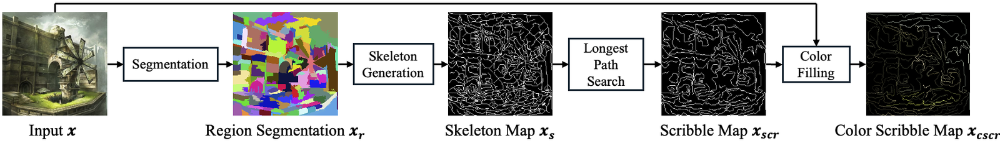

# DetFill-with-DHT: Deterministic Hints and Hint-AUC for Line Art Colorization

[](https://doi.org/10.1109/TVCG.2026.3738401)
[](https://doi.org/10.1109/TVCG.2026.3738401)
[](LICENSE)
[](#installation)
[](#installation)
[](https://github.com/MADONOKOUKI/DetFill-with-DHT/releases)

Official implementation of **"Hint-AUC: Deterministic Region-based Hint Generation for Line Art Colorization Evaluation"**
(Koki Madono, Yuan Mingcheng, Edgar Simo-Serra — IEEE Transactions on Visualization and Computer Graphics, 2026).



## Highlights

- **Deterministic hints (DHT).** The same illustration always yields the same scribble and dot hints, so
  hint-based colorization methods can be compared without random-seed luck.
- **Hint-AUC.** One number that scores a model over the *whole* range of hint ratios, from no hints to fully hinted.
- **DetFill.** A pixel-space diffusion colorization model trained with these hints, with all checkpoints released.
- **Reproducible.** Tables are rebuilt from released metric files, every experiment can be re-run on example images
  with one command, and the paper's key figure is reproduced end-to-end by a single script.

## News

- **2026-09** — Code, checkpoints, data and the full reproduction package are public. The paper is accepted at IEEE TVCG.

## Installation

```bash
pip install git+https://github.com/MADONOKOUKI/DetFill-with-DHT.git
# with the perceptual metrics (LPIPS / OpenCLIP / DINOv2 / DreamSim):
pip install "hintauc[perceptual] @ git+https://github.com/MADONOKOUKI/DetFill-with-DHT.git"
```

For training or inference with DetFill, or for reproducing the paper, use the conda environment
`replicability/environment.yml` (Python 3.9, PyTorch 2.5.1, CUDA 12.4; it also runs on CPU).

## Quick start

```python
import hintauc

hints = hintauc.generate_hints("illustration.png", size=64)        # image -> deterministic hints
color, mask = hints.at_ratio(0.10, hint_type="scribble")           # hints of the largest 10 % of the regions
hints.save("out/illustration")                                     # files in the DetFill data layout

evaluator = hintauc.Evaluator(metrics=("psnr", "lpips", "dreamsim"))
print(evaluator("colorized.png", "ground_truth.png"))              # the paper's metrics
```

Command line: `hintauc generate image.png --ratio 0.1` and `hintauc eval pred_dir gt_dir --metrics mse psnr ssim`.
DetFill inference over the hint-ratio grid: `cd detfill && GPU=0 bash run_inference.sh scribble`
(data layout and options in [detfill/README.md](detfill/README.md)).

## Model zoo

| Model | Hints | Base channels | Trained on | Download |
|---|---|---|---|---|
| DetFill (paper) | scribble | 96 | Danbooru2021 | [v1.0](https://github.com/MADONOKOUKI/DetFill-with-DHT/releases/tag/v1.0) `detfill_scribble_illust_200ep.pth` (1.08 GB) |
| DetFill (paper) | dot | 64 | Danbooru2021 | [v1.0](https://github.com/MADONOKOUKI/DetFill-with-DHT/releases/tag/v1.0) `detfill_dot_illust_200ep.pth` (0.48 GB) |
| DetFill, DanbooRegion hints | scribble | 96 | Danbooru2021 | [v1.1](https://github.com/MADONOKOUKI/DetFill-with-DHT/releases/tag/v1.1) |
| DetFill, SLIC hints | scribble | 96 | Danbooru2021 | [v1.1](https://github.com/MADONOKOUKI/DetFill-with-DHT/releases/tag/v1.1) |
| DetFill, natural images | scribble / dot | 96 | ImageNet subset | [v1.2](https://github.com/MADONOKOUKI/DetFill-with-DHT/releases/tag/v1.2) |
| Diffusart retrained with our hints | scribble / dot | — | Danbooru2021 | [v1.2](https://github.com/MADONOKOUKI/DetFill-with-DHT/releases/tag/v1.2) |
| DetFill, channel ablation | scribble | 32 / 64 | Danbooru2021 | [legacy-2024](https://github.com/MADONOKOUKI/DetFill-with-DHT/releases/tag/legacy-2024) |
| DetFill, 2024 submission | scribble / dot | 64 | Danbooru2021 / ImageNet | [legacy-2024](https://github.com/MADONOKOUKI/DetFill-with-DHT/releases/tag/legacy-2024) |

Data: the stored hint maps of the 3,000 test images (v1.0), the test-split line art from the three extractors, the
alternative-segmenter hint maps, the example bundle and the user-study stimuli (v1.3). Every file with size and
SHA-256: [checkpoints/README.md](checkpoints/README.md).

## Reproducing the paper

All scripts fetch what they need from the releases (SHA-256 verified). Requirements: Linux, Miniconda, ~10 GB of disk,
an NVIDIA GPU (CPU works but is slow).

| Goal | Command (no arguments) | Time |
|---|---|---|
| **Fig. 9** end to end (the Replicability-Stamp script) | `bash replicability/run.sh` | GPU ≈ 3 min, CPU ≈ 30 min |
| **Every table** rebuilt from the released metric files | `python reproduce/scripts/A1_tables_from_released_metrics.py` (322/324 cells match)<br>`python reproduce/scripts/A2_userstudy_glmm.py` (all values match) | < 2 min, CPU |
| **Every experiment** re-run on 12 example illustrations | `bash reproduce/examples/run_examples.sh` | smoke ≈ 5 min, default ≈ 1 h, full = hours |
| **A whole table row** on the 3,000 test images | `DATA_ROOT=… bash reproduce/scripts/run_hauc_pipeline.sh` | ≈ 14 GPU-h per row |
| **Training** from scratch | `bash reproduce/scripts/B9_train_detfill.sh` | days, 10 GPUs |

Results are compared automatically with the paper's numbers, the paper's archived images of the same examples and the
authors' reference run. Guide, coverage table and the list of what is bit-exact and what is not:
[reproduce/README.md](reproduce/README.md). Background on every component: [detail_explanation.md](detail_explanation.md).

## Added features (since the paper) for improving our library

- `hintauc` pip library and command line (hint generation, the seven metrics, Hint-AUC).
- Dependency-free, bit-exact longest path `path_method="geodesic"`; dot options `medoid` / `mean` / `nearest_mean`;
  region tie-breaking `tie_break="stable"`.
- Protocol switch `hint_order: area | label` (Table II vs. Table III) in the DetFill loader; training option `include_full_hint`.
- CPU inference, a flat user-configurable data layout, deterministic region-id colours, other segmenters in the generator.
- The replicability script, the reproduction package and the additional releases (v1.1–v1.3, legacy-2024).

Small documented differences between the paper's text and the released code/data are listed in
[detail_explanation.md](detail_explanation.md#changes-relative-to-the-paper).

## Repository structure

```
replicability/     one-command reproduction of Fig. 9
reproduce/         reproduction package: scripts/, examples/, expected/ (released metrics), data/, paper_experiments/
hintauc/           the library: hints.py, metrics.py, auc.py, cli.py
detfill/           the DetFill model (BBDM fork): training, inference, configs
hint_generation/   original research scripts behind the library
evaluation/        original evaluation scripts
checkpoints/       inventory of all released files with hashes
assets/            images for this page; representative image for the Replicability Stamp
```

## Citation

```bibtex
@article{madono2026hintauc,
  title   = {Hint-AUC: Deterministic Region-based Hint Generation for Line Art Colorization Evaluation},
  author  = {Madono, Koki and Mingcheng, Yuan and Simo-Serra, Edgar},
  journal = {IEEE Transactions on Visualization and Computer Graphics},
  year    = {2026},
  doi     = {10.1109/TVCG.2026.3738401}
}
```

## License and acknowledgements

MIT License; third-party components in [THIRD_PARTY_NOTICES.md](THIRD_PARTY_NOTICES.md). `detfill/` is built on
[BBDM](https://github.com/xuekt98/BBDM) (MIT). Released data files are derived from Danbooru2021 illustrations and are
provided for non-commercial research use only.
