# Detailed explanation

Companion to the README. Sections: [pipeline](#pipeline) · [library](#library) · [DetFill](#detfill) ·
[Hint-AUC](#hint-auc) · [reproduction](#reproduction) · [determinism](#what-is-exact-and-what-is-not) ·
[environment](#environment) · [releases](#releases) · [added features](#added-features-since-the-paper).

## Pipeline

Deterministic hint generation (DHT) turns one illustration into a fixed set of colour hints:

1. **Region segmentation** — Felzenszwalb (scale 100, σ 0.5, min size 100) on the 512×512 illustration; region maps are
   stored at 64×64 (nearest-neighbour downsampling), which is the paper's hint resolution.
2. **Skeleton** — Zhang–Suen thinning of each region, then a 3×3 dilation.
3. **Longest path** — the longest path of the skeleton of each region (FilFinder2D 1.7.2 in the paper, branch and
   skeleton thresholds 3 px); the path is intersected with its region.
4. **Scribble hint** — the path pixels, coloured with the region's mean colour.
5. **Dot hint** — one pixel per region: the in-region path pixel with the smallest total Manhattan distance to the other
   in-region path pixels (first index on ties). This is the rule behind the released maps; the paper's text describes a
   truncated mean of the path coordinates (available as `dot_method="mean"`).
6. **Hint ratio α** — at evaluation time the hints of the largest ⌊α·n⌋ regions are kept (Table II protocol); the
   Table III protocol keeps the first ⌊α·n⌋ regions in ascending label order instead ("fixed random order").

What the library produces for one illustration:

| Input | Region map | Flatten (region mean) | Scribble hints | Dot hints |
|:---:|:---:|:---:|:---:|:---:|
|  | 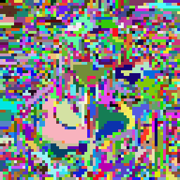 |  | 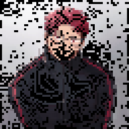 | 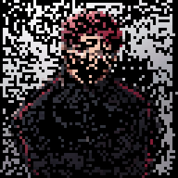 |

| α = 1 % | α = 10 % | α = 50 % | α = 100 % |
|:---:|:---:|:---:|:---:|
| 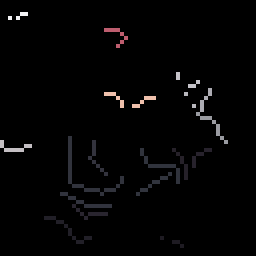 | 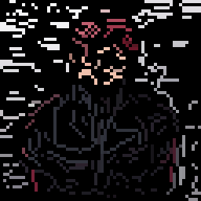 | 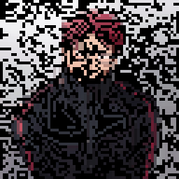 |  |

## Library

`hintauc` (`pip install hintauc`; `pip install "hintauc[perceptual]"` adds the perceptual metrics) exposes:

- `hintauc.generate_hints(image, size=64, path_method="filfinder", dot_method="medoid", segmenter="felzenszwalb")`
  → `HintResult` with `.at_ratio(alpha, hint_type="scribble"|"dot", tie_break="default"|"stable")` (returns colour and
  mask arrays in OpenCV BGR order) and `.save(prefix)` (writes the canonical `*_region64`, `*_scribble_col64`,
  `*_scribble_mask64`, `*_dot_col64`, `*_dot_mask64` files used by the DetFill loader).
- `hintauc.Evaluator(metrics=(...))` — MSE, PSNR, SSIM (256×256, values in [0, 1]), LPIPS (AlexNet), OpenCLIP
  (ViT-B-32, laion2b), DINOv2-base, DreamSim; the same formulas as the paper's `evaluation/eval_single_run.py`.
- Metrics added after the paper (opt-in, never used for a published number): `mae`, `ms_ssim` (torchmetrics),
  `deltae` (mean CIEDE2000 colour difference in CIELAB via scikit-image — a direct colour-fidelity measure),
  `lpips_vgg`, `dists` (DISTS_pytorch), and the set-level `hintauc.evaluate_set(pred_dir, gt_dir, metrics=("fid", "kid"))`
  (Inception features via torchmetrics + torch-fidelity; KID is the better choice for small sets). `hintauc.ALL_METRICS`
  lists the per-image metrics, `hintauc.SET_METRICS` the set-level ones; `LOWER_IS_BETTER` gives each metric's direction.
- `hintauc.hint_auc`, `hintauc.evaluate_hint_curve` — trapezoidal integration over α ∈ [0, 1];
  `hintauc.DEFAULT_ALPHAS` is the paper grid {0, 0.01, 0.03, 0.05, 0.10, 0.25, 0.50, 1.00}.
- Command line: `hintauc generate image.png --ratio 0.1 [--path_method geodesic] [--dot_method mean]`,
  `hintauc eval pred_dir gt_dir --metrics mse psnr ssim`.

Two longest-path implementations:

| `path_method` | Method | Dependencies | Deterministic? |
|---|---|---|---|
| `filfinder` (paper) | 3×3 dilation, then FilFinder2D medial axis, pruning by length, longest path | `fil_finder`, `astropy` | up to FilFinder's unseeded medial-axis tie-breaking (a few pixels may move between environments) |
| `geodesic` | longest shortest path (geodesic diameter) of the 8-connected skeleton, no corner cutting, raster-order ties | NumPy only | yes, bit-exact |

Do not mix maps produced with different methods in one evaluation; the paper's numbers and the released stored maps
correspond to `filfinder`. On 20 stored test maps (16,098 regions) the two methods return an identical path in 91.8 % of
the regions (mean IoU 0.969) and the dot coincides in 95.5 %.

## DetFill

- A pixel-space Brownian Bridge diffusion model ([BBDM](https://github.com/xuekt98/BBDM) fork) conditioned on the line
  art and the hint maps. State: 5 channels (line art, hint mask, RGB); condition: 5 channels (line art, hint mask,
  masked RGB hints); U-Net input 10 channels. Scribble model: 96 base channels; dot model: 64 base channels; 200 epochs,
  effective batch 20 (10 GPUs × batch 1 × gradient accumulation 2), seed 1234, 200 sampling steps at inference.
- Data layout, configs, training and inference commands: [detfill/README.md](detfill/README.md).
  `detfill/run_inference.sh` runs the ratio grid; `dataset_config.hint_order` selects the Table II (`area`) or Table III
  (`label`) protocol; `--gpu_ids -1` runs on CPU.
- Training-time hint sampling follows the paper (p = ⌊n·u⌋, u ~ U[0, 1), so the fully hinted case is never seen in
  training); `dataset_config.include_full_hint: true` changes this. The released checkpoints use the paper setting.

## Hint-AUC

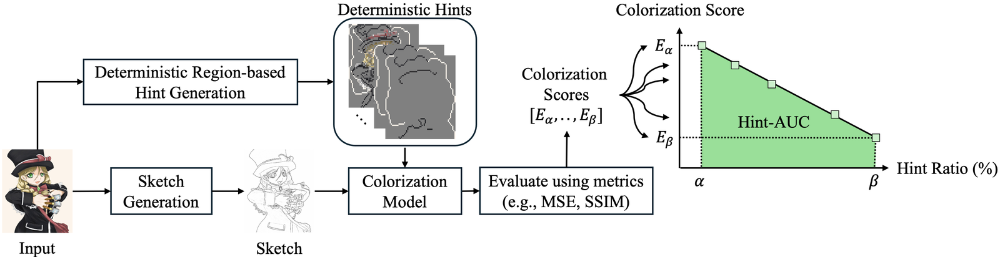

For each ratio α of the grid the model colorizes the test set with the deterministic hints at that ratio; the per-ratio
mean of each metric is integrated over α with the trapezoidal rule (the α range has length 1, so the integral is the
range-normalised value). Tables report the mean ± sample standard deviation of the Hint-AUC over the three line-art
sources (XDoG, sketch simplification, SketchKeras), never over random seeds — the protocol is deterministic.

DetFill colorizations for one sketch as the scribble hint ratio grows:

| Input sketch | Ground truth |
|:---:|:---:|
| 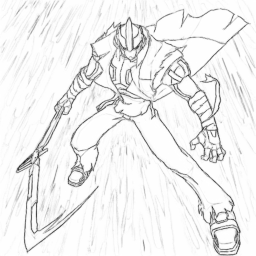 | 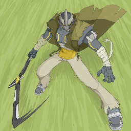 |

| | α = 1 % | α = 10 % | α = 50 % | α = 100 % |
|:--|:---:|:---:|:---:|:---:|
| Scribble hints | 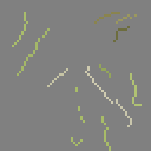 | 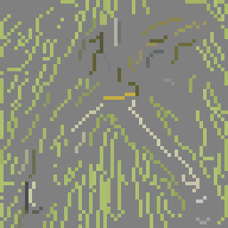 | 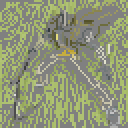 | 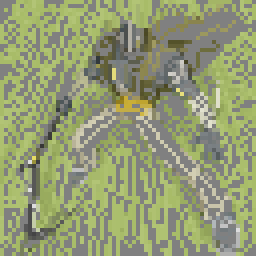 |
| DetFill | 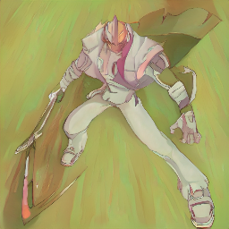 | 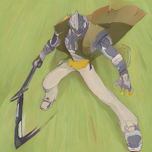 | 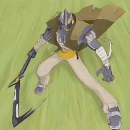 | 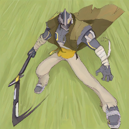 |

## Reproduction

Four layers, documented in [reproduce/README.md](reproduce/README.md):

- **A. Tables from released metrics** — `reproduce/scripts/A1_tables_from_released_metrics.py` rebuilds Table II
  (DetFill scribble row), Table III (DetFill scribble row) and the supplementary α-grid, segmentation-dependency,
  seed-sensitivity and Diffusart-retrain tables from the per-ratio metric files in `reproduce/expected/`, checking every
  printed cell (322 of 324 match; the two exceptions are the SSIM rounding and the Diffusart-retrain SSIM provenance gap
  listed in the README). `A2_userstudy_glmm.py` rebuilds Tables IV/V and the GLMM statistics from the anonymised trial
  table (all values match).
- **B. Example suite** — `reproduce/examples/run_examples.sh` (no arguments) re-runs each experiment on 12 example
  illustrations with the released checkpoints and compares with the authors' reference run and with the paper's
  archived outputs of the same images; [reproduce/examples/README.md](reproduce/examples/README.md).
- **C. Verbatim launchers** — `reproduce/paper_experiments/`.
- **D. Full-scale rows** — `reproduce/scripts/run_hauc_pipeline.sh` + `eval_per_ratio.py` (needs the Danbooru2021
  originals; line art and hint maps are released).
- **Fig. 9** — `replicability/run.sh` ([replicability/README.md](replicability/README.md)).

## What is exact and what is not

- **Exact:** the table recomputation (A), the user-study numbers, the metric evaluator (to ~1e-6 with the pinned
  packages; SSIM to 5e-5), the region selection at every ratio (given the stored maps and the pinned NumPy).
- **Deterministic per machine, not bit-exact across machines:** DetFill inference is seeded, but CUDA kernels differ
  between GPU generations and CPU, so re-generated outputs of the same image agree with the paper's archived outputs
  only approximately (about 25–30 dB PSNR between the two images in our checks). Per-image metrics therefore move a
  little; we have not re-run a complete table row on different hardware, so expect small differences in the last printed
  digit of a re-run table.
- **Deterministic per environment:** FilFinder longest paths (medial-axis tie-breaking is unseeded); use the stored
  maps to compare with printed numbers. The `geodesic` method is bit-exact everywhere.
- **Not covered by released per-ratio data:** baseline rows (PaintsTorch, Diffusart, ColorizeDiffusion), the DetFill
  dot rows of Tables II/III, the ImageNet tables and the legacy per-source tables; they can be regenerated with layer D
  and the respective code, except the ColorizeDiffusion fine-tuned weights, which were not preserved.

## Environment

**Hardware behind the timings.** Machine A: NVIDIA RTX A6000 (48 GB), 2 × AMD EPYC 9124 (32 threads), 377 GB RAM.
Machine B: NVIDIA GeForce RTX 2080 Ti (11 GB), 2 × Intel Xeon Gold 6226R (32 threads), 187 GB RAM. Both Ubuntu 22.04,
driver 535, CUDA 12.2. Fig. 9: 3 min on A, 4–5 min on B, 30 min on the CPUs of A (16 threads). Example suite and the
full-scale estimates: measured on B; an A6000-class GPU is roughly twice as fast.

- `replicability/environment.yml` (used by `replicability/run.sh` and `reproduce/examples/run_examples.sh`): Python 3.9,
  PyTorch 2.5.1 + CUDA 12.4 wheels (run on CPU too), NumPy 1.26.4, scikit-image, OpenCV, FilFinder 1.7.2 + astropy 5.3.4,
  pytorch-lightning 1.9.3, torchmetrics 1.4.0.
- `reproduce/requirements-metrics.txt`: open_clip_torch 3.3.0, dreamsim 0.2.1, transformers 4.57.6, lpips 0.1.4,
  torchmetrics 1.4.0 (the perceptual metrics download their weights on first use, ~2 GB).
- `detfill/environment.yml`: the paper's training/inference environment (NumPy 2.0.2). The order of equal-area regions
  in the hint selection follows NumPy's default `argsort`, which can differ between NumPy builds; `tie_break="stable"`
  removes this dependence (the published results used NumPy 2.0.2 with the default order).

## Releases

| Release | Contents |
|---|---|
| v1.0 | paper checkpoints (scribble 96-ch, dot 64-ch), stored test-split hint maps |
| v1.1 | DanbooRegion- and SLIC-trained scribble models |
| v1.2 | Diffusart-retrain models (our Diffusart re-implementation), ImageNet DetFill models, ImageNet test hint maps |
| v1.3 | test-split line art (SketchKeras / sketch simplification / XDoG), DanbooRegion / SLIC / Felzenszwalb test hint maps, example bundle, user-study stimuli |
| legacy-2024 | 2024-submission models, 32 / 64-channel scribble models, archived configs |

Sizes and SHA-256 of every file: [checkpoints/README.md](checkpoints/README.md).

## Added features since the paper

- `hintauc` library + CLI; `path_method="geodesic"`; `dot_method` and `tie_break` options; `hint_order` protocol switch;
  `include_full_hint` training option; CPU inference; flat user-configurable data layout; deterministic region-id colours;
  segmenter options in the generator; metrics beyond the paper's seven (MAE, MS-SSIM, CIEDE2000, LPIPS-VGG, DISTS,
  set-level FID / KID); the replicability script; the reproduction package; releases v1.1–v1.3 and legacy-2024.
- A few minor issues of the original implementation were fixed along the way to make the library more usable; what is
  bit-exact with respect to the published numbers and what is not is listed in
  [reproduce/README.md](reproduce/README.md#known-deviations-and-gaps-honest-list).

Third-party components and their licenses: [THIRD_PARTY_NOTICES.md](THIRD_PARTY_NOTICES.md).
